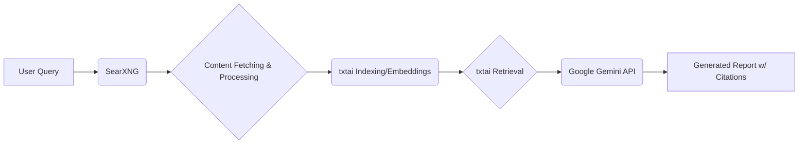

# Deep Research Tool

An automated tool leveraging a self-hosted SearXNG instance, the txtai library with local embeddings, and the Google Gemini API to conduct in-depth research and generate comprehensive, cited reports. This tool prioritizes the quality and accuracy of research output.

## Key Features

*   **Privacy-Preserving Search:** Utilizes a self-hosted [SearXNG](https://github.com/searxng/searxng) instance for meta-search capabilities without compromising user privacy.
*   **Semantic Understanding:** Employs [txtai](https://github.com/neuml/txtai) with local embedding models (e.g., `all-MiniLM-L6-v2`) for efficient semantic indexing and retrieval of processed content.
*   **AI-Powered Synthesis:** Uses the [Google Gemini API](https://ai.google.dev/) for Retrieval-Augmented Generation (RAG) to synthesize information from retrieved sources into coherent reports.
*   **Source Citation:** Automatically includes citations linking the generated report content back to the original source documents.
*   **Containerized:** Deployed using [Docker](https://www.docker.com/) and [Docker Compose](https://docs.docker.com/compose/) for simplified setup and environment management.

## Architecture Overview

The tool follows a Retrieval-Augmented Generation (RAG) pattern:

1.  A user query is sent to the local SearXNG instance.
2.  SearXNG fetches search results from various sources.
3.  The content from result URLs is fetched, cleaned, and chunked.
4.  txtai indexes these chunks using local embedding models.
5.  For report generation, txtai retrieves relevant chunks based on the query.
6.  The retrieved chunks (context) and the query are sent to the Google Gemini API.
7.  Gemini generates a comprehensive report grounded in the provided context, including citations.



## Technologies Used

*   [SearXNG](https://github.com/searxng/searxng)
*   [txtai](https://github.com/neuml/txtai)
*   [Google Gemini API](https://ai.google.dev/)
*   [Docker](https://www.docker.com/) & [Docker Compose](https://docs.docker.com/compose/)
*   [Python](https://www.python.org/)
*   (Optional: [Traefik](https://traefik.io/traefik/) can be integrated for reverse proxying)

## Getting Started

### Prerequisites

*   Docker Engine installed
*   Docker Compose installed
*   A Google Gemini API Key

### Installation

1.  **Clone the repository:**
    ```bash
    git clone https://github.com/your-username/researcher.git # Replace with actual URL
    cd researcher
    ```
2.  **Configure SearXNG:**
    *   Ensure the `json` format is enabled in `searxng_data/settings.yml`. Add `- json` to the `formats:` list under the `search:` section if it's not already present. Refer to the [SearXNG documentation](https://docs.searxng.org/admin/settings.html) for more details on configuration.
    *   *Note:* A basic `settings.yml` might need to be created or provided within `searxng_data` if not included.
3.  **Set up API Key:**
    *   Create a file named `.env` in the project root directory (where `docker-compose.yml` is located).
    *   Add your Google Gemini API key to the `.env` file:
      ```dotenv
      GEMINI_API_KEY=YOUR_API_KEY_HERE
      ```
4.  **Build and Run Containers:**
    ```bash
    docker-compose up -d --build
    ```
    This command builds the `research_app` image (if not already built) and starts both the `searxng` and `research_app` services in detached mode.

## Usage

The primary interaction with the tool is through the API provided by the `research_app` service.

*   **API Endpoint:** The application runs on port 5000 inside the container (mapped to port 5000 on the host by default in `docker-compose.yml`).
*   **Example Request (Conceptual):** Send a POST request to an endpoint like `/research` (verify the actual endpoint in `research_app/app.py`) with a JSON body containing your research query:
    ```json
    {
      "query": "What are the latest advancements in quantum computing?"
    }
    ```
*   **Response:** The API will return the generated research report with citations.

*(Note: Check `research_app/app.py` for the specific API endpoint(s) and request/response formats.)*

## Configuration

*   **SearXNG:** Customize search engines, enabled categories, result formats, and other options in `searxng_data/settings.yml`.
*   **Google Gemini API Key:** Set the `GEMINI_API_KEY` variable in the `.env` file.
*   **txtai Embedding Model:** The model used for embeddings (default: `all-MiniLM-L6-v2`) is configured within the `research_app` code (likely in `research_app/txtai_manager.py` or similar).
*   **Docker:** Modify ports, volumes, network settings, or add other services (like Traefik) in `docker-compose.yml`.

## Hardware Considerations

This tool is designed with the expectation of running on modest hardware (e.g., i3 3rd gen, 16GB DDR3 RAM, SSD).

*   **Performance:** Indexing large amounts of data and generating complex reports may take significant time on lower-spec hardware. The system prioritizes report quality over processing speed.
*   **Memory:** The `all-MiniLM-L6-v2` embedding model is relatively lightweight, but RAM usage will increase with the size of the indexed data. 16GB should be sufficient for moderate use cases.
*   **Storage:** An SSD is recommended for faster index loading and saving.

## License

(Please add an appropriate license file (e.g., LICENSE) and update this section. Example: MIT License)
